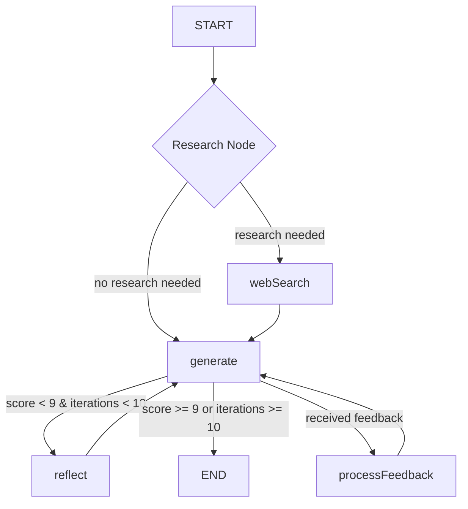

# Auto Content Creator Agent

## Workflow Diagram

### Workflow Steps Explanation:

1. **Start**: The workflow begins when a content creation request is received
2. **Research Node**: Dynamically decides if research is needed by analyzing:
   - Current context (initial request vs feedback)
   - Nature of the request/feedback
   - Type of information needed
3. **Generate**: Creates or updates content based on instructions/research/feedback
4. **Decision Points**:
   - If reflection score >= 9 or max iterations reached → END
   - If human feedback received → Process Feedback
   - Otherwise → Reflect
5. **Reflect**: Evaluates content quality and provides a score
6. **Process Feedback**: Incorporates human feedback to improve content
7. **End**: Returns final content when quality threshold is met

The workflow uses dynamic research decisions, performing research only when it would materially improve the response to the current request, whether that's an initial request or feedback iteration.
