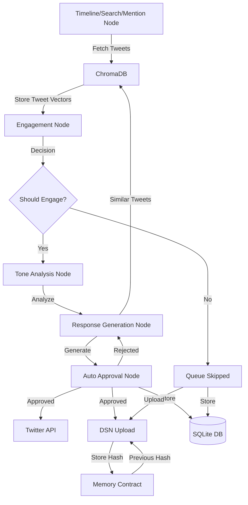

# Auto-KOL: AI Agent Campaign Framework for Twitter Engagement

Auto-KOL is an intelligent agent framework designed to engage with thought leaders (Key Opinion Leaders) on Twitter through automated, context-aware interactions.

## Features

- Automated tweet monitoring and response generation
- Multi-step workflow with engagement decision making
- Tone analysis and adaptive response strategies
- Agent Review with Feedback
- Rate limit handling and queue management
- Extensible agent architecture

## Prerequisites

- Node.js (v16 or higher)
- Twitter API credentials
- OpenAI API key

## Installation

1. Clone the repository:
`git clone https://github.com/yourusername/auto-kol.git`

2. Install dependencies:
`npm install`

3. Configure environment variables:
`cp .env.sample .env`

Edit `.env` with your credentials

## Usage

1. ChromaDB is used as a vector database to store tweet embeddings. First, pull the docker image:
`docker pull chromadb/chroma:latest`

2. Then, run the docker container:
`docker run -d -p 8000:8000 chromadb/chroma:latest`

3. Start the development server:
`yarn dev`

4. Build for production:
`yarn build`

5. Start production server:
`yarn start`

## API Endpoints

### Health Check
- GET `/health`

### Response Management
- GET `/responses/:id/workflow` - Get workflow state for a response

### Tweet Management
- GET `/tweets/skipped` - Get all skipped tweets
- GET `/tweets/skipped/:id` - Get specific skipped tweet
- POST `/tweets/skipped/:id/queue` - Move skipped tweet to response queue

### DSN Management
- GET `/dsn` - Get all DSN records
- GET `/dsn/:tweetId` - Get DSN record for a specific tweet

## Architecture

The system follows a multi-stage workflow:

1. Tweet Monitoring
2. Engagement Decision
3. Tone Analysis
4. Response Generation
5. Agent Review with Feedback
6. Response Execution

### Data Flow

### Components

- **Timeline/Search Node**: Fetches tweets from target KOL accounts
- **ChromaDB**: Vector database for semantic tweet storage and similarity search
- **Engagement Node**: LLM-powered decision making for tweet engagement
- **Tone Analysis**: Analyzes tweet tone and suggests response strategy
- **Response Generation**: Creates context-aware responses using similar tweets
- **SQLite DB**: Stores tweets, responses, and interaction history
- **Agent Review**: Special node to review responses and provide feedback
- **DSN**: Decentralized storage for approved interactions

## License

MIT